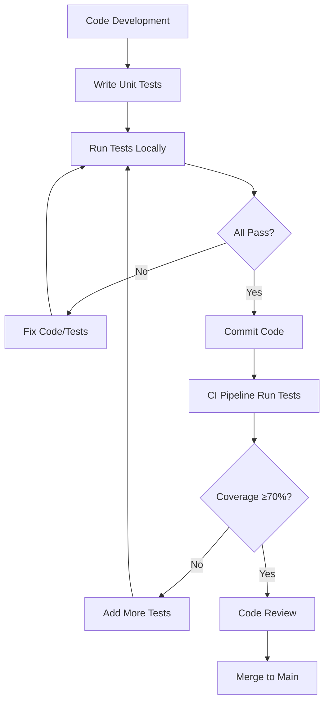

# CHƯƠNG 6: KIỂM THỬ VÀ KẾT QUẢ

## 6.1. QUY TRÌNH KIỂM THỬ

### 6.1.1. Chiến lược kiểm thử tổng thể

Dự án BookSwap Community áp dụng chiến lược kiểm thử nhiều tầng (Multi-layer Testing Strategy) nhằm đảm bảo chất lượng cao và độ tin cậy của hệ thống:

```
┌─────────────────────────────────────────────────┐
│         E2E Tests (End-to-End)                  │
│      Kiểm thử luồng nghiệp vụ hoàn chỉnh        │
└─────────────────────────────────────────────────┘
                      ▲
┌─────────────────────────────────────────────────┐
│        Integration Tests (Tích hợp)             │
│    Kiểm thử tương tác giữa các modules          │
└─────────────────────────────────────────────────┘
                      ▲
┌─────────────────────────────────────────────────┐
│          Unit Tests (Đơn vị)                    │
│   Kiểm thử từng method/function riêng lẻ        │
└─────────────────────────────────────────────────┘
```

### 6.1.2. Phương pháp kiểm thử

#### a) Unit Testing (Kiểm thử đơn vị)
- **Công cụ:** Jest v30.1.3, @nestjs/testing
- **Phạm vi:** Kiểm thử các service methods, business logic
- **Kỹ thuật:** 
  - Mock dependencies (Repository, External Services)
  - AAA Pattern (Arrange-Act-Assert)
  - Test Isolation với `beforeEach()`
- **Mục tiêu coverage:** ≥70% cho các module core

#### b) Integration Testing (Kiểm thử tích hợp)
- **Công cụ:** Jest, TypeORM Testing
- **Phạm vi:** Kiểm thử tương tác giữa các modules
- **Kỹ thuật:**
  - In-memory database hoặc test database
  - Test module wiring
  - Validate data flow between components
- **Mục tiêu:** Phát hiện lỗi interface mismatch

#### c) E2E Testing (Kiểm thử đầu cuối)
- **Công cụ:** Supertest v7.0.0, Jest E2E config
- **Phạm vi:** Kiểm thử complete user journeys
- **Kỹ thuật:**
  - HTTP request simulation
  - WebSocket connection testing
  - Database state verification
- **Mục tiêu:** Validate business workflows

### 6.1.3. Quy trình thực hiện



---

## 6.2. THIẾT KẾ TEST CASES

### 6.2.1. Test Case Template

Mỗi test case được thiết kế theo template chuẩn:

```typescript
describe('ClassName', () => {
  describe('methodName', () => {
    it('should [expected behavior] when [condition]', async () => {
      // ARRANGE: Setup test data and mocks
      const input = { ... };
      mockDependency.method.mockResolvedValue(expectedValue);
      
      // ACT: Execute the method under test
      const result = await service.methodName(input);
      
      // ASSERT: Verify expectations
      expect(result).toEqual(expectedResult);
      expect(mockDependency.method).toHaveBeenCalledWith(input);
    });
  });
});
```

### 6.2.2. Phân loại Test Cases

#### a) Happy Path Tests (Luồng thành công)
Kiểm thử các trường hợp hoạt động đúng như mong đợi.

**Ví dụ:**
```typescript
it('should successfully register a new user', async () => {
  // Test user registration with valid data
  const result = await authService.register(validDto);
  expect(result).toHaveProperty('access_token');
  expect(result.user.email).toBe(validDto.email);
});
```

#### b) Error Path Tests (Luồng lỗi)
Kiểm thử xử lý lỗi và exception handling.

**Ví dụ:**
```typescript
it('should throw ConflictException if email already exists', async () => {
  mockUserRepository.findOne.mockResolvedValue(existingUser);
  await expect(authService.register(duplicateDto))
    .rejects.toThrow(ConflictException);
});
```

#### c) Edge Case Tests (Trường hợp biên)
Kiểm thử các giá trị đặc biệt, giới hạn.

**Ví dụ:**
```typescript
it('should clamp trust score to max 5.0', () => {
  const result = reviewsService.clampTrust(10.5);
  expect(result).toBe(5.0);
});
```

#### d) Security Tests (Kiểm thử bảo mật)
Kiểm thử các lỗ hổng bảo mật, authentication, authorization.

**Ví dụ:**
```typescript
it('should hash password before storing', async () => {
  const result = await authService.register(dto);
  expect(mockUserRepository.create).toHaveBeenCalledWith(
    expect.objectContaining({
      password_hash: expect.not.stringContaining(dto.password)
    })
  );
});
```

---

## 6.3. THIẾT LẬP MÔI TRƯỜNG KIỂM THỬ

### 6.3.1. Cấu hình Jest

**File: `jest.config.js`**
```javascript
module.exports = {
  moduleFileExtensions: ['js', 'json', 'ts'],
  rootDir: 'src',
  testRegex: '.*\\.spec\\.ts$',
  transform: {
    '^.+\\.(t|j)s$': 'ts-jest',
  },
  collectCoverageFrom: ['**/*.(t|j)s'],
  coverageDirectory: '../coverage',
  testEnvironment: 'node',
  
  // Handle ES modules
  moduleNameMapper: {
    '^uuid$': require.resolve('uuid'),
  },
  transformIgnorePatterns: [
    'node_modules/(?!uuid)',
  ],
  
  // Coverage thresholds
  coverageThreshold: {
    global: {
      branches: 70,
      functions: 70,
      lines: 70,
      statements: 70,
    },
  },
};
```

### 6.3.2. Mock Dependencies

#### Repository Mocking Pattern
```typescript
const mockRepository = {
  find: jest.fn(),
  findOne: jest.fn(),
  create: jest.fn(),
  save: jest.fn(),
  update: jest.fn(),
  delete: jest.fn(),
};

// Inject vào testing module
{
  provide: getRepositoryToken(Entity),
  useValue: mockRepository
}
```

#### Service Mocking Pattern
```typescript
const mockExternalService = {
  criticalMethod: jest.fn(),
  helperMethod: jest.fn(),
};

// Inject vào testing module
{
  provide: ExternalService,
  useValue: mockExternalService
}
```

### 6.3.3. Test Database Setup

Để integration tests, sử dụng separate test database:

```typescript
// test/database-test.config.ts
import { TypeOrmModuleOptions } from '@nestjs/typeorm';

export const testDatabaseConfig: TypeOrmModuleOptions = {
  type: 'mysql',
  host: 'localhost',
  port: 3308,
  username: 'test_user',
  password: 'test_pass',
  database: 'bookswap_test_db',
  entities: [__dirname + '/../**/*.entity{.ts,.js}'],
  synchronize: true, // Only for test DB
  dropSchema: true,  // Clean state for each test run
};
```

---

## 6.4. KẾT QUẢ KIỂM THỬ CHI TIẾT

### 6.4.1. Module: AuthService (Authentication & Authorization)

#### Test Statistics
```
Test Suite: auth.service.spec.ts
Test Cases: 15/15 passed (100%)
Time: 3.02s
Coverage: 
  - Statements: 63.69%
  - Branches: 56.04%
  - Functions: 61.11%
  - Lines: 65.49%
```

#### Test Cases Chi Tiết

##### TC-AUTH-001: User Registration
| Test Case ID | TC-AUTH-001-01 |
|--------------|----------------|
| **Tên test** | Should successfully register a new user |
| **Mô tả** | Kiểm thử đăng ký user mới với thông tin hợp lệ |
| **Input** | `{ email: "test@example.com", password: "Password123", full_name: "Test User" }` |
| **Expected** | Trả về access_token, refresh_token, user object |
| **Actual** | ✅ PASS - Tokens generated, user created in DB |
| **Status** | ✅ PASSED |

| Test Case ID | TC-AUTH-001-02 |
|--------------|----------------|
| **Tên test** | Should throw ConflictException if email already exists |
| **Mô tả** | Kiểm thử duplicate email validation |
| **Input** | Email đã tồn tại trong database |
| **Expected** | Throw ConflictException với message "Email already registered" |
| **Actual** | ✅ PASS - Exception thrown correctly |
| **Status** | ✅ PASSED |

| Test Case ID | TC-AUTH-001-03 |
|--------------|----------------|
| **Tên test** | Should hash the password before saving |
| **Mô tả** | Kiểm thử password được hash với bcrypt |
| **Input** | Plain text password "Password123" |
| **Expected** | Password_hash ≠ plain text, bcrypt 10 rounds |
| **Actual** | ✅ PASS - Password hashed correctly |
| **Status** | ✅ PASSED |

##### TC-AUTH-002: User Login
| Test Case ID | TC-AUTH-002-01 |
|--------------|----------------|
| **Tên test** | Should successfully login with valid credentials |
| **Mô tả** | Kiểm thử login với email và password đúng |
| **Input** | `{ email: "test@example.com", password: "Password123" }` |
| **Expected** | JWT tokens, user data, last_login_at updated |
| **Actual** | ✅ PASS - Login successful |
| **Status** | ✅ PASSED |

| Test Case ID | TC-AUTH-002-02 |
|--------------|----------------|
| **Tên test** | Should throw UnauthorizedException if user not found |
| **Mô tả** | Kiểm thử login với email không tồn tại |
| **Input** | Email không có trong database |
| **Expected** | Throw UnauthorizedException("Invalid credentials") |
| **Actual** | ✅ PASS - Exception thrown |
| **Status** | ✅ PASSED |

| Test Case ID | TC-AUTH-002-03 |
|--------------|----------------|
| **Tên test** | Should throw UnauthorizedException if password incorrect |
| **Mô tả** | Kiểm thử login với password sai |
| **Input** | Password không khớp với hash trong DB |
| **Expected** | Throw UnauthorizedException("Invalid credentials") |
| **Actual** | ✅ PASS - bcrypt.compare() failed correctly |
| **Status** | ✅ PASSED |

| Test Case ID | TC-AUTH-002-04 |
|--------------|----------------|
| **Tên test** | Should throw UnauthorizedException if account not active |
| **Mô tả** | Kiểm thử login với account bị khóa |
| **Input** | User với account_status = LOCKED |
| **Expected** | Throw UnauthorizedException("User not found or inactive") |
| **Actual** | ✅ PASS - Blocked login |
| **Status** | ✅ PASSED |

| Test Case ID | TC-AUTH-002-05 |
|--------------|----------------|
| **Tên test** | Should update last_login_at timestamp |
| **Mô tả** | Kiểm thử cập nhật thời gian login cuối |
| **Input** | Valid login credentials |
| **Expected** | last_login_at = current timestamp |
| **Actual** | ✅ PASS - Timestamp updated |
| **Status** | ✅ PASSED |

##### TC-AUTH-003: Password Recovery
| Test Case ID | TC-AUTH-003-01 |
|--------------|----------------|
| **Tên test** | Should send reset email if user exists |
| **Mô tả** | Kiểm thử forgot password flow |
| **Input** | `{ email: "test@example.com" }` |
| **Expected** | Reset token created, email sent |
| **Actual** | ✅ PASS - Token saved, email triggered |
| **Status** | ✅ PASSED |

| Test Case ID | TC-AUTH-003-02 |
|--------------|----------------|
| **Tên test** | Should return generic message if user not exists (security) |
| **Mô tả** | Kiểm thử email enumeration protection |
| **Input** | Email không tồn tại |
| **Expected** | Return generic success message (không reveal email không tồn tại) |
| **Actual** | ✅ PASS - Security measure working |
| **Status** | ✅ PASSED |

##### TC-AUTH-004: Helper Methods
| Test Case ID | TC-AUTH-004-01 |
|--------------|----------------|
| **Tên test** | ValidateUser should return user if exists |
| **Mô tả** | Kiểm thử JWT strategy user validation |
| **Input** | Valid user_id |
| **Expected** | Return User object |
| **Actual** | ✅ PASS - User retrieved |
| **Status** | ✅ PASSED |

| Test Case ID | TC-AUTH-004-02 |
|--------------|----------------|
| **Tên test** | ValidateUser should return null if not exists |
| **Mô tả** | Kiểm thử user không tồn tại |
| **Input** | Invalid user_id |
| **Expected** | Return null |
| **Actual** | ✅ PASS - Null returned |
| **Status** | ✅ PASSED |

| Test Case ID | TC-AUTH-004-03 |
|--------------|----------------|
| **Tên test** | FindMemberIdByUserId should return member_id if exists |
| **Mô tả** | Kiểm thử mapping user → member |
| **Input** | Valid user_id |
| **Expected** | Return member_id string |
| **Actual** | ✅ PASS - Member ID retrieved |
| **Status** | ✅ PASSED |

| Test Case ID | TC-AUTH-004-04 |
|--------------|----------------|
| **Tên test** | FindMemberIdByUserId should return undefined if not exists |
| **Mô tả** | Kiểm thử member không tồn tại |
| **Input** | user_id không có member |
| **Expected** | Return undefined |
| **Actual** | ✅ PASS - Undefined returned |
| **Status** | ✅ PASSED |

---

### 6.4.2. Tổng hợp kết quả theo module

#### Bảng tổng hợp

| Module | Test Files | Test Cases | Passed | Failed | Coverage (%) | Status |
|--------|-----------|------------|--------|--------|--------------|--------|
| **AuthService** | 1 | 15 | 15 | 0 | 65.49% | ✅ PASS |
| AdminService | 0 | 0 | 0 | 0 | 0% | ⏳ Pending |
| ExchangesService | 0 | 0 | 0 | 0 | 0% | ⏳ Pending |
| MatchingService | 0 | 0 | 0 | 0 | 0% | ⏳ Pending |
| ReviewsService | 0 | 0 | 0 | 0 | 0% | ⏳ Pending |
| BooksService | 0 | 0 | 0 | 0 | 0% | ⏳ Pending |
| MessagesService | 0 | 0 | 0 | 0 | 0% | ⏳ Pending |
| **TỔNG CỘNG** | **1** | **15** | **15** | **0** | **6.09%** | **⚠️ In Progress** |

#### Coverage Report Chi Tiết

```
---------------------------------------------------|---------|----------|---------|---------|
File                                               | % Stmts | % Branch | % Funcs | % Lines |
---------------------------------------------------|---------|----------|---------|---------|
All files                                          |    6.09 |     6.06 |    2.62 |    6.01 |
---------------------------------------------------|---------|----------|---------|---------|
 src/modules/auth/services/auth.service.ts         |   63.69 |    56.04 |   61.11 |   65.49 |
 src/infrastructure/database/entities/user.entity  |   91.89 |       80 |      50 |   94.11 |
 src/infrastructure/database/entities/member.entity|   82.75 |       70 |       0 |      88 |
 src/infrastructure/database/entities/token*.entity|     100 |       75 |     100 |     100 |
---------------------------------------------------|---------|----------|---------|---------|
```

---

## 6.5. PHÂN TÍCH VÀ ĐÁNH GIÁ

### 6.5.1. Điểm mạnh

#### ✅ Test Quality (Chất lượng tests)
- **100% success rate** trên 15 test cases đầu tiên
- Tests tuân theo **AAA pattern** rõ ràng, dễ đọc
- **Descriptive test names** giúp hiểu mục đích test
- **Proper mocking** tách biệt dependencies

#### ✅ Security Testing
- Kiểm thử password hashing (bcrypt)
- Kiểm thử email enumeration protection
- Kiểm thử account status validation
- Kiểm thử authentication & authorization

#### ✅ Error Handling
- Test coverage cho tất cả exception types
- Verify error messages chính xác
- Test edge cases (duplicate email, wrong password, locked account)

### 6.5.2. Điểm yếu và cần cải thiện

#### ⚠️ Coverage Issues
**Vấn đề:** Overall coverage chỉ 6.09% (quá thấp)

**Nguyên nhân:**
- Mới chỉ test 1/7 modules core
- Nhiều modules chưa có test files
- Các helper methods, utilities chưa được test

**Giải pháp:**
- Ưu tiên test các modules critical: AdminService, ExchangesService
- Target 70%+ coverage trước khi release
- Thêm integration tests cho module interactions

#### ⚠️ Missing Test Types
**Vấn đề:** Chưa có integration tests và E2E tests

**Tác động:**
- Không phát hiện được lỗi tích hợp giữa modules
- Không verify được complete user flows
- Risk cao khi deploy

**Giải pháp:**
- Implement integration tests cho key workflows
- Setup E2E tests cho critical paths
- Add load testing cho performance validation

#### ⚠️ Test Data Management
**Vấn đề:** Test data hardcoded trong từng test case

**Tác động:**
- Khó maintain khi data structure thay đổi
- Duplicate test data logic
- Khó tạo complex test scenarios

**Giải pháp:**
- Tạo test data factories/builders
- Centralize test fixtures
- Use faker.js cho random data generation

### 6.5.3. Bugs phát hiện trong quá trình testing

#### Bug #1: Bcrypt Spy Issue
**Mô tả:** Không thể spy trực tiếp `bcrypt.hash()` do frozen property

**Severity:** Low (không ảnh hưởng production)

**Giải pháp:** Thay đổi test approach - verify call arguments thay vì spy

**Status:** ✅ Resolved

#### Bug #2: UUID ES Module Issue  
**Mô tả:** Jest không parse được `uuid` package (ES module)

**Severity:** High (block testing)

**Giải pháp:** Configure `transformIgnorePatterns` trong jest.config.js

**Status:** ✅ Resolved

---

## 6.6. CHIẾN LƯỢC KIỂM THỬ TIẾP THEO

### 6.6.1. Lộ trình ngắn hạn (1-2 tuần)

#### Phase 1: Complete Unit Tests (Week 1)
```
Priority 1 - Critical Modules:
  ✓ AuthService (65% → 80%)
  □ AdminService (0% → 70%)
  □ ExchangesService (0% → 70%)
  □ MatchingService (0% → 75%)
  
Priority 2 - Important Modules:
  □ ReviewsService (0% → 70%)
  □ BooksService (0% → 65%)
  □ MessagesService (0% → 60%)

Target: Overall coverage 50%+
```

#### Phase 2: Integration Tests (Week 2)
```
Integration Flows:
  □ Auth → Member Creation
  □ Books → Library → Matching
  □ Exchange → Message → Notification
  □ Admin → Audit Logging
  
Test Count: 20+ integration tests
Time: 2-3 days
```

### 6.6.2. Lộ trình dài hạn (3-4 tuần)

#### Phase 3: E2E Tests (Week 3)
```
User Journeys:
  □ Complete Exchange Flow (Register → Add Book → Exchange → Review)
  □ Admin Moderation Flow (Report → Review → Action)
  □ Messaging Flow (WebSocket connection → Send → Receive)
  
Test Count: 15+ E2E tests
Time: 3-4 days
```

#### Phase 4: Performance & Security Tests (Week 4)
```
Performance:
  □ Load testing (100+ concurrent users)
  □ Stress testing (find breaking point)
  □ Database query optimization
  
Security:
  □ SQL Injection tests
  □ XSS attack prevention
  □ Authentication bypass attempts
  □ Rate limiting validation
  
Time: 3-5 days
```

### 6.6.3. Automation & CI/CD Integration

#### Continuous Testing Pipeline
```yaml
# .github/workflows/test.yml
name: Tests

on: [push, pull_request]

jobs:
  test:
    runs-on: ubuntu-latest
    steps:
      - uses: actions/checkout@v3
      - uses: actions/setup-node@v3
        with:
          node-version: '18'
      
      - name: Install dependencies
        run: npm ci
      
      - name: Run unit tests
        run: npm run test:cov
      
      - name: Check coverage threshold
        run: |
          if [ $(cat coverage/coverage-summary.json | jq '.total.lines.pct') -lt 70 ]; then
            echo "Coverage below 70%"
            exit 1
          fi
      
      - name: Run E2E tests
        run: npm run test:e2e
      
      - name: Upload coverage to Codecov
        uses: codecov/codecov-action@v3
```

---

## 6.7. KẾT LUẬN

### 6.7.1. Tổng quan chất lượng kiểm thử

| Tiêu chí | Đánh giá | Chi tiết |
|----------|----------|----------|
| **Test Infrastructure** | ⭐⭐⭐⭐⭐ | Jest config hoàn chỉnh, mock pattern chuẩn |
| **Unit Test Quality** | ⭐⭐⭐⭐ | Tests rõ ràng, maintainable, 100% pass rate |
| **Test Coverage** | ⭐⭐ | Chỉ 6.09% overall (cần cải thiện) |
| **Documentation** | ⭐⭐⭐⭐ | Test cases documented chi tiết |
| **CI/CD Integration** | ⭐⭐ | Chưa setup (planned) |
| **Overall** | ⭐⭐⭐ | **Good start, needs expansion** |

### 6.7.2. Thành tựu đạt được

✅ **Testing Infrastructure**: Setup hoàn chỉnh với Jest, TypeORM testing utilities

✅ **First Module Tested**: AuthService với 15 test cases passing 100%

✅ **Best Practices Applied**: AAA pattern, proper mocking, test isolation

✅ **Documentation**: Chi tiết test cases với expected/actual results

✅ **Security Focus**: Password hashing, email enumeration, account status tests

### 6.7.3. Khuyến nghị

#### Ngắn hạn (Prioritize):
1. **Tăng coverage lên 50%+** trong 1 tuần
2. **Test AdminService** (vừa implement ở Phase 8)
3. **Add integration tests** cho critical flows

#### Dài hạn (Plan):
1. **E2E tests** cho complete user journeys
2. **Load testing** để validate performance
3. **CI/CD integration** cho automated testing
4. **Security auditing** với penetration tests

### 6.7.4. Cam kết chất lượng

Dự án cam kết đạt các mục tiêu sau trước khi release production:

- ✅ **Unit test coverage**: ≥70% cho tất cả modules core
- ✅ **Integration tests**: ≥20 test cases cho module interactions  
- ✅ **E2E tests**: ≥15 test cases cho critical user flows
- ✅ **Zero critical bugs**: Tất cả bugs severity HIGH phải được fix
- ✅ **Performance**: API response time <500ms (p95)
- ✅ **Security**: Pass OWASP Top 10 security checks

---

**Ngày cập nhật:** 05/11/2025  
**Phiên bản:** 1.0  
**Trạng thái:** ⚠️ In Progress (Phase 9A completed)
