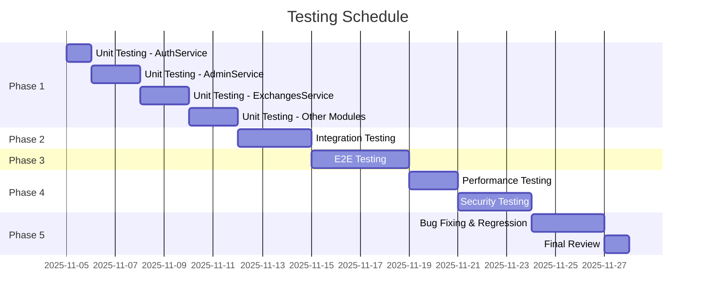
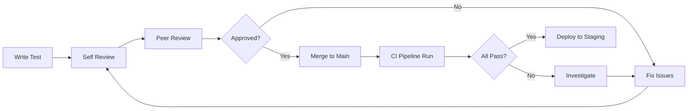

# TEST PLAN - DỰ ÁN BOOKSWAP COMMUNITY

**Version:** 1.0  
**Date:** 05/11/2025  
**Author:** Development Team  
**Status:** Active

---

## 1. MỤC ĐÍCH

Tài liệu này mô tả chiến lược kiểm thử tổng thể cho hệ thống BookSwap Community, bao gồm:
- Phạm vi kiểm thử
- Loại kiểm thử sẽ thực hiện
- Test cases chi tiết
- Tiêu chí pass/fail
- Lịch trình thực hiện

---

## 2. PHẠM VI KIỂM THỬ

### 2.1. In-Scope (Sẽ kiểm thử)

#### Backend API
- ✅ Authentication & Authorization (AuthModule)
- ✅ User Management (AdminModule)
- ✅ Book Management (BooksModule)
- ✅ Personal Library (LibraryModule)
- ✅ Exchange System (ExchangesModule)
- ✅ Matching Algorithm (MatchingService)
- ✅ Messaging System (MessagesModule)
- ✅ Review & Rating (ReviewsModule)
- ✅ Reporting System (ReportsModule)
- ✅ Notification System (NotificationsModule)

#### Database
- ✅ Schema validation
- ✅ CRUD operations
- ✅ Transactions & rollback
- ✅ Foreign key constraints
- ✅ Query performance

#### WebSocket
- ✅ Real-time messaging
- ✅ Connection handling
- ✅ Event broadcasting

### 2.2. Out-of-Scope (Không kiểm thử)

- ❌ Frontend UI testing (Sẽ do Frontend team thực hiện)
- ❌ Mobile app testing
- ❌ Infrastructure testing (Docker, Kubernetes)
- ❌ Third-party services (SendGrid, Google Books API)

---

## 3. LOẠI KIỂM THỬ

### 3.1. Unit Testing (Kiểm thử đơn vị)

**Mục tiêu:** Kiểm thử từng function/method độc lập

**Coverage target:** ≥70% cho các modules core

**Modules ưu tiên:**

| Module | Methods | Priority | Target Coverage |
|--------|---------|----------|----------------|
| AuthService | 18 | Critical | 80% |
| AdminService | 18 | High | 75% |
| ExchangesService | 25 | High | 75% |
| MatchingService | 12 | High | 80% |
| ReviewsService | 10 | Medium | 70% |
| BooksService | 22 | Medium | 70% |
| MessagesService | 20 | Medium | 65% |

**Estimate:** 150+ test cases, 5-7 days

### 3.2. Integration Testing (Kiểm thử tích hợp)

**Mục tiêu:** Kiểm thử tương tác giữa các modules

**Key Integration Points:**

1. **Auth → Member Flow**
   - Register user → Create member profile
   - Login → Fetch member data
   - JWT validation → Access control

2. **Books → Library → Matching**
   - Add book → Update personal library
   - Mark wanted book → Update match pool
   - Generate suggestions → Score calculation

3. **Exchange → Message → Notification**
   - Create exchange request → Open conversation
   - Send message → Trigger notification
   - Complete exchange → Update statistics

**Estimate:** 25+ test cases, 2-3 days

### 3.3. E2E Testing (Kiểm thử đầu cuối)

**Mục tiêu:** Kiểm thử complete user journeys

**Critical User Flows:**

1. **Complete Exchange Journey** (15-20 steps)
   ```
   Register → Verify Email → Login → Add Books → 
   Mark Wanted → Generate Suggestions → Create Request → 
   Accept → Message → Confirm → Review
   ```

2. **Admin Moderation Flow** (8-10 steps)
   ```
   User Reports Violation → Admin Reviews → 
   Admin Takes Action → User Notified → Audit Log Created
   ```

3. **Real-time Messaging Flow** (5-7 steps)
   ```
   User A Connects → User B Connects → 
   Send Message → Real-time Receive → 
   Database Persisted → Read Receipt
   ```

**Estimate:** 15+ test cases, 3-4 days

### 3.4. Performance Testing (Kiểm thử hiệu năng)

**Mục tiêu:** Validate system under load

**Test Scenarios:**

| Scenario | Concurrent Users | Duration | Success Criteria |
|----------|-----------------|----------|------------------|
| Normal Load | 50 | 10 min | Response <500ms (p95) |
| Peak Load | 100 | 10 min | Response <1s (p95) |
| Stress Test | 200+ | 5 min | No crashes |
| Endurance | 50 | 2 hours | No memory leaks |

**Tools:** k6, Artillery

**Estimate:** 2-3 days

### 3.5. Security Testing (Kiểm thử bảo mật)

**Mục tiêu:** Phát hiện lỗ hổng bảo mật

**Test Areas:**

- ✅ SQL Injection
- ✅ XSS (Cross-Site Scripting)
- ✅ CSRF (Cross-Site Request Forgery)
- ✅ Authentication bypass
- ✅ Authorization bypass
- ✅ Rate limiting
- ✅ Password security
- ✅ JWT token security

**Tools:** OWASP ZAP, Burp Suite

**Estimate:** 2-3 days

---

## 4. TEST ENVIRONMENT

### 4.1. Development Environment
```
Database: MySQL 8.0.43 (localhost:3308)
Node.js: v18+
Framework: NestJS v11
Testing: Jest v30.1.3
OS: Windows/Linux/macOS
```

### 4.2. Test Environment (Isolated)
```
Database: bookswap_test_db (separate instance)
API: http://localhost:3001
WebSocket: ws://localhost:3001
Redis: localhost:6380 (test cache)
```

### 4.3. CI/CD Environment (Planned)
```
Platform: GitHub Actions
Triggers: Push to main/develop, Pull Request
Database: Docker MySQL container
Cache: Docker Redis container
```

---

## 5. TEST DATA STRATEGY

### 5.1. Test Data Sources

#### Static Test Data (Fixtures)
```typescript
// test/fixtures/users.fixture.ts
export const testUsers = {
  validUser: {
    email: 'test@bookswap.com',
    password: 'Test123456',
    full_name: 'Test User',
  },
  adminUser: {
    email: 'admin@bookswap.com',
    password: 'Admin123456',
    full_name: 'Admin User',
    role: 'ADMIN',
  },
};
```

#### Dynamic Test Data (Faker.js)
```typescript
import { faker } from '@faker-js/faker';

export const generateUser = () => ({
  email: faker.internet.email(),
  password: faker.internet.password({ length: 12 }),
  full_name: faker.person.fullName(),
  phone: faker.phone.number(),
  region: faker.location.city(),
});
```

### 5.2. Test Database Management

**Before Each Test Suite:**
```sql
-- Truncate all tables
TRUNCATE TABLE exchanges;
TRUNCATE TABLE messages;
TRUNCATE TABLE reviews;
-- ... (all tables)

-- Seed baseline data
INSERT INTO users VALUES (...);
INSERT INTO members VALUES (...);
```

**After Each Test Suite:**
```sql
-- Clean up test data
DELETE FROM users WHERE email LIKE '%@test.com';
DELETE FROM audit_logs WHERE created_at < DATE_SUB(NOW(), INTERVAL 1 HOUR);
```

---

## 6. DEFECT MANAGEMENT

### 6.1. Bug Severity Levels

| Level | Description | Example | Response Time |
|-------|-------------|---------|---------------|
| **Critical** | System crash, data loss | Database corruption | <2 hours |
| **High** | Core feature broken | Login fails | <4 hours |
| **Medium** | Feature partially broken | Pagination not working | <1 day |
| **Low** | Minor issue, workaround exists | Typo in error message | <3 days |

### 6.2. Bug Reporting Template

```markdown
# BUG-XXX: [Short Description]

## Severity: [Critical/High/Medium/Low]

## Environment:
- OS: Windows 11
- Browser: Chrome 119
- API Version: v1.2.3

## Steps to Reproduce:
1. Navigate to /auth/login
2. Enter email: test@example.com
3. Enter password: Test123
4. Click Login button

## Expected Result:
User should be logged in and redirected to dashboard

## Actual Result:
"Invalid credentials" error shown even with correct password

## Screenshots:
[Attach screenshots here]

## Logs:
```
[ERROR] AuthService.login - bcrypt.compare failed
```

## Proposed Fix:
Check bcrypt hash comparison logic in auth.service.ts:205
```

---

## 7. TEST EXECUTION SCHEDULE

### 7.1. Timeline



### 7.2. Milestones

| Date | Milestone | Deliverable |
|------|-----------|-------------|
| 05/11/2025 | Phase 1 Start | Unit tests for AuthService complete |
| 11/11/2025 | Phase 1 Complete | All unit tests done, 70%+ coverage |
| 14/11/2025 | Phase 2 Complete | Integration tests done |
| 18/11/2025 | Phase 3 Complete | E2E tests done |
| 23/11/2025 | Phase 4 Complete | Performance & security validated |
| 27/11/2025 | **Testing Complete** | All tests pass, documentation ready |

---

## 8. TRÁCH NHIỆM & PHÂN CÔNG

### 8.1. Test Team Structure

| Role | Responsibilities | Member |
|------|-----------------|--------|
| **Test Lead** | Overall strategy, coordination | TBD |
| **Unit Test Engineer** | Write unit tests, achieve coverage | Dev Team |
| **Integration Test Engineer** | Module interaction tests | Dev Team |
| **E2E Test Engineer** | User journey tests | Dev Team |
| **Performance Test Engineer** | Load & stress testing | DevOps Team |
| **Security Test Engineer** | Security auditing | Security Team |

### 8.2. Review Process



---

## 9. DELIVERABLES

### 9.1. Test Artifacts

| Artifact | Format | Location |
|----------|--------|----------|
| Test Plan | Markdown | `/docs/TEST_PLAN.md` |
| Test Cases | TypeScript | `/src/**/*.spec.ts` |
| Test Report | Markdown | `/docs/CHUONG_6_KIEM_THU_VA_KET_QUA.md` |
| Coverage Report | HTML | `/coverage/lcov-report/index.html` |
| Performance Report | JSON | `/reports/k6-results.json` |
| Bug Report | Markdown | `/docs/BUGS_TRACKING.md` |

### 9.2. Success Criteria

✅ **PASS Criteria:**
- All critical & high bugs fixed
- Unit test coverage ≥70%
- Integration tests ≥90% pass rate
- E2E tests 100% pass rate for critical flows
- Performance: API response <500ms (p95)
- Security: No HIGH/CRITICAL vulnerabilities

❌ **FAIL Criteria:**
- Any critical bug unfixed
- Unit test coverage <60%
- E2E tests fail on critical flows
- Performance: API response >1s (p95)
- Security: HIGH/CRITICAL vulnerabilities exist

---

## 10. RISKS & MITIGATION

### 10.1. Testing Risks

| Risk | Impact | Probability | Mitigation |
|------|--------|-------------|------------|
| Insufficient test coverage | High | Medium | Daily tracking, mandatory reviews |
| Test environment instability | Medium | Low | Use Docker containers |
| Tight schedule | High | Medium | Prioritize critical tests first |
| Test data issues | Medium | Medium | Automated seed scripts |
| Tool limitations | Low | Low | Research alternatives early |

### 10.2. Contingency Plans

**Scenario 1: Behind schedule**
- Focus on critical paths only
- Defer low-priority tests
- Add resources if needed

**Scenario 2: Too many bugs found**
- Extend testing phase
- Prioritize by severity
- Implement triage process

**Scenario 3: Test environment down**
- Switch to backup environment
- Use Docker for isolation
- Document issues for infra team

---

## 11. KẾT LUẬN

Test Plan này đảm bảo:
- ✅ **Coverage toàn diện**: Unit + Integration + E2E + Performance + Security
- ✅ **Quy trình rõ ràng**: Từ planning → execution → reporting
- ✅ **Tiêu chuẩn chất lượng**: 70%+ coverage, <500ms response time
- ✅ **Risk management**: Identify risks và có mitigation plans

**Approval:**

| Role | Name | Signature | Date |
|------|------|-----------|------|
| Test Lead | TBD | ___________ | ______ |
| Tech Lead | TBD | ___________ | ______ |
| Project Manager | TBD | ___________ | ______ |

---

**Document Control:**
- **Version:** 1.0
- **Last Updated:** 05/11/2025
- **Next Review:** 12/11/2025
